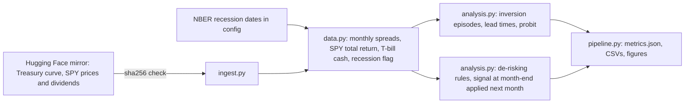

# Architecture

```mermaid
flowchart LR
  A[Hugging Face mirror: Treasury curve, SPY prices and dividends] -->|sha256 check| B[ingest.py]
  N[NBER recession dates in config] --> C
  B --> C[data.py: monthly spreads, SPY total return, T-bill cash, recession flag]
  C --> D[analysis.py: inversion episodes, lead times, probit]
  C --> E[analysis.py: de-risking rules, signal at month-end applied next month]
  D & E --> F[pipeline.py: metrics.json, CSVs, figures]
```

Modules: `ingest.py`, `data.py`, `analysis.py`, `figures.py`, `pipeline.py`. Tests: `tests/test_core.py`.
